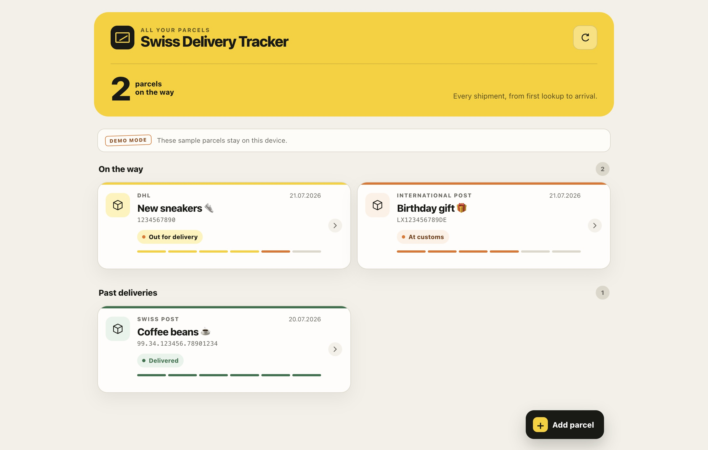

<p align="center">
  
</p>

<h1 align="center">Swiss Delivery Tracker</h1>

<p align="center">
  A new home for your packages, built for Switzerland.
</p>

<p align="center">
  <a href="https://github.com/plhery/swiss-delivery-tracker/actions/workflows/ci.yml"></a>
  <a href="LICENSE"></a>
  <a href="https://delivery.plhery.com"></a>
</p>

<p align="center">
  <strong><a href="https://delivery.plhery.com">Open the public instance →</a></strong>
</p>



Swiss Delivery Tracker follows parcels from Post CH, UPS, DPD, Planzer and
other carriers in one tidy, installable web app. Sign in on any device, get push
notifications, and keep every tracking number private to your account.

## What it does

- Tracks supported carriers automatically and links out gracefully for the rest.
- Checks active deliveries every 10 minutes from 08:00 to 22:00, and hourly overnight.
- Understands tracking numbers, carrier URLs and text pasted from shipping emails, with
  one-tap paste on web and barcode scanning on iPhone.
- Keeps search and filters tucked away until needed, and surfaces the next parcel and ETA.
- Keeps delivery history in sync across your devices.
- Sends optional browser and native iPhone notifications without putting tracking numbers in them.
- Includes a real SwiftUI iPhone app and Share extension, plus the installable PWA.
- Uses Supabase Auth and Postgres row-level security to isolate every account.

The full [carrier list and caveats](docs/CARRIERS.md) are documented separately.

## Native iPhone app

The native SwiftUI target lives in [`ios/`](ios/README.md). It mirrors the web
app’s authentication, carrier parsing, parcel actions, search/filter/sort,
tracking timeline, notification preferences, archive, guarded direct parcel deletion,
account export/deletion,
offline snapshot, demo mode, and four languages. It uses standard iOS lists,
forms, menus, sheets, swipe actions and sharing, with a restrained Liquid Glass
treatment on iOS 26 and a material fallback on iOS 18–25.

Open `ios/SwissDeliveryTracker.xcodeproj` in Xcode to run the self-contained
demo. See the [native setup guide](ios/README.md) to connect it to this service,
configure Supabase Auth, the App Group, signing, and APNs.

## Try it locally

The local app starts in demo mode with fictional parcels, so no account or
database is needed:

```bash
git clone https://github.com/plhery/swiss-delivery-tracker.git
cd swiss-delivery-tracker
nvm use
npm ci
npm run dev
```

Open [http://localhost:5173](http://localhost:5173). Refreshing advances the
sample deliveries through their journey.

## Self-host it

You will need a Supabase project or self-hosted stack, a public HTTPS hostname,
and Docker.

1. Apply the SQL files in `supabase/migrations/` in filename order.
2. Configure Google OAuth, email OTP with custom SMTP, or both by following the
   [authentication guide](docs/AUTHENTICATION.md).
3. Copy `.env.example` to `.env` and replace its example runtime values.
4. Build the frontend with the same public Supabase URL and publishable key:

```bash
docker build \
  --build-arg VITE_SUPABASE_URL=https://supabase.example.com \
  --build-arg VITE_SUPABASE_PUBLISHABLE_KEY=your-public-key \
  --build-arg VITE_AUTH_GOOGLE_ENABLED=true \
  --build-arg VITE_AUTH_EMAIL_OTP_ENABLED=false \
  -t swiss-delivery-tracker .

docker run --rm --env-file .env -p 3000:3000 swiss-delivery-tracker
```

The Supabase URL and publishable key are intentionally browser-visible. Keep
the service-role key, OAuth secret, SMTP password and VAPID private key on the
server. The [deployment runbook](docs/DEPLOYMENT.md) covers migrations, legacy
data, HTTPS, Auth and production verification in detail.

## Project guide

- [Authentication](docs/AUTHENTICATION.md)
- [Architecture and security boundaries](docs/ARCHITECTURE.md)
- [Deployment](docs/DEPLOYMENT.md)
- [Carriers](docs/CARRIERS.md)
- [Privacy](PRIVACY.md) and [security policy](SECURITY.md)
- [Contributing](CONTRIBUTING.md)

The web frontend is React and TypeScript, the iPhone app is SwiftUI, and the
small Python service handles carrier sync, Supabase-backed storage, Web Push,
and APNs. CI tests both sides, the production
container, database migrations and cross-account RLS isolation.

Licensed under [Apache 2.0](LICENSE).
